# research_presentation_1

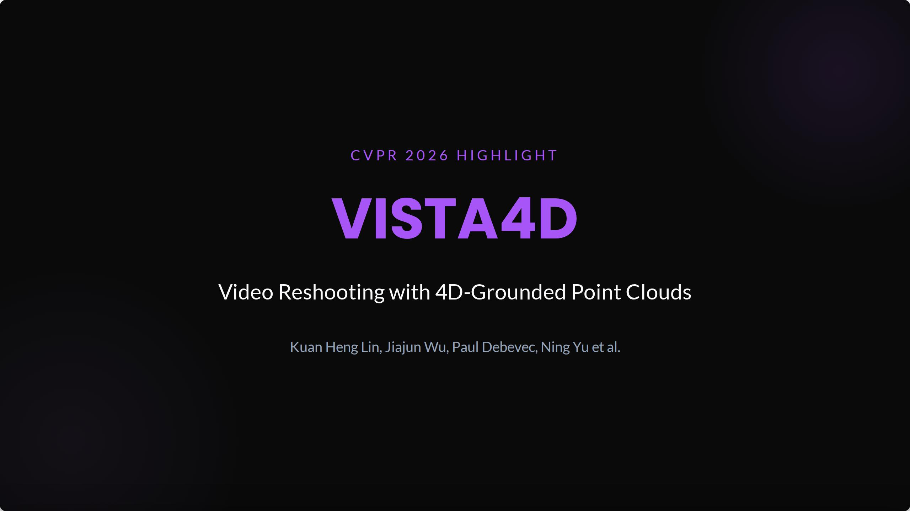

<!-- Page 2 -->

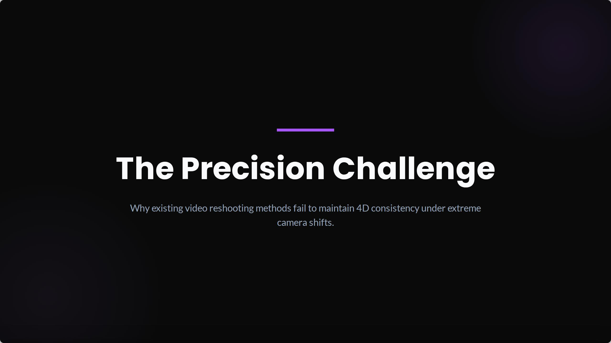

<!-- Page 3 -->

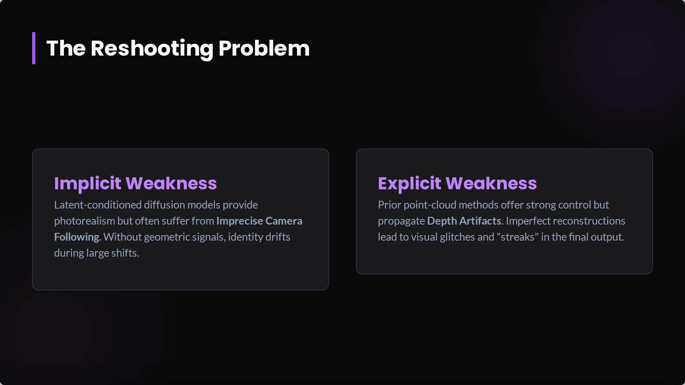

<!-- Page 4 -->

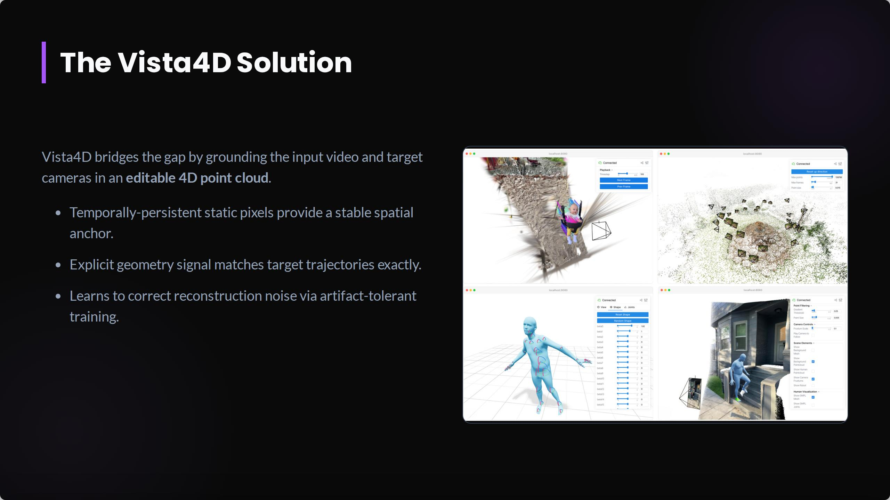

<!-- Page 5 -->

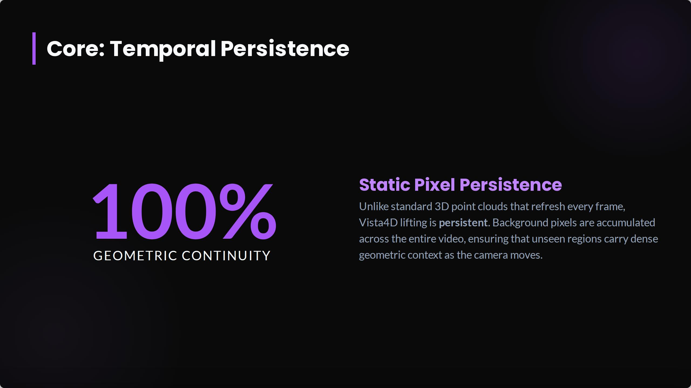

<!-- Page 6 -->

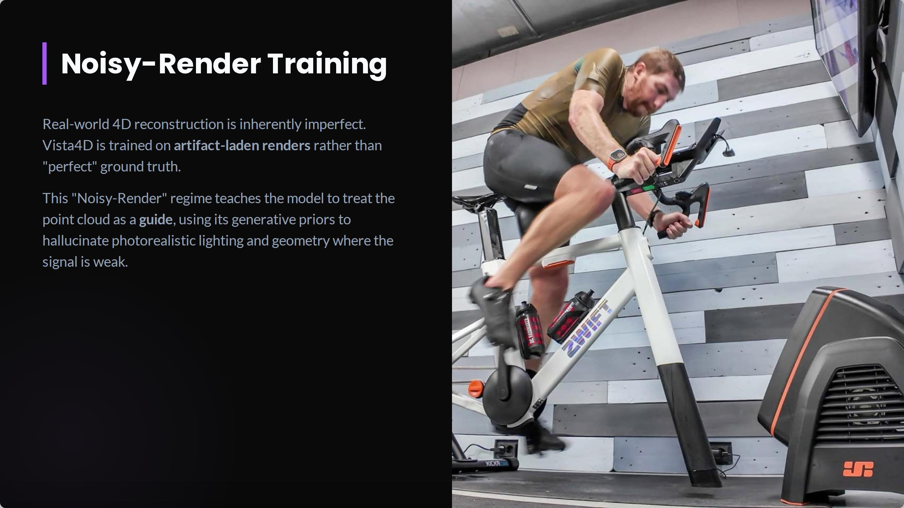

<!-- Page 7 -->

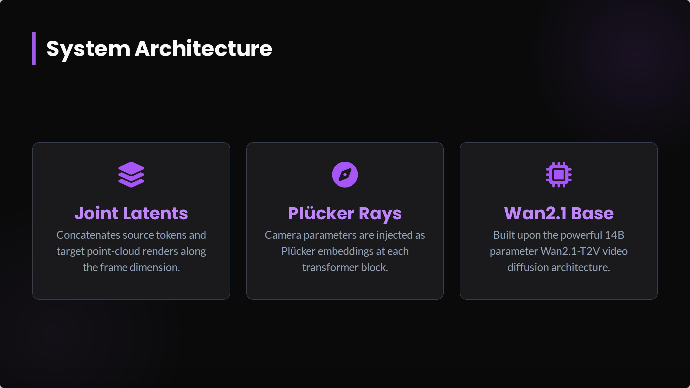

<!-- Page 8 -->

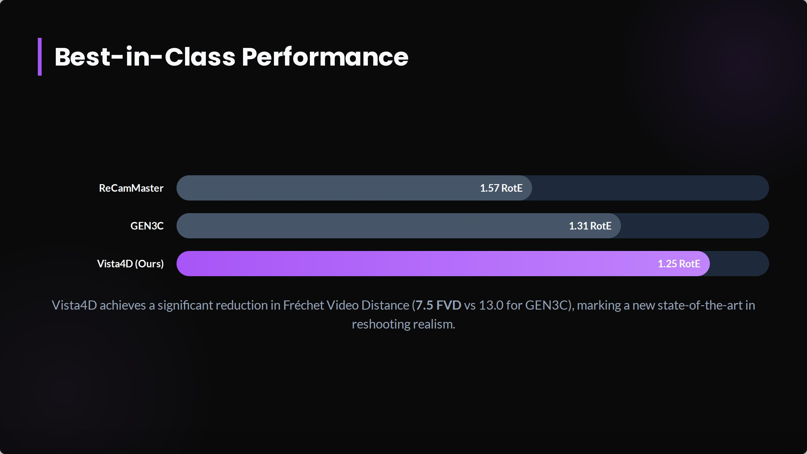

<!-- Page 9 -->

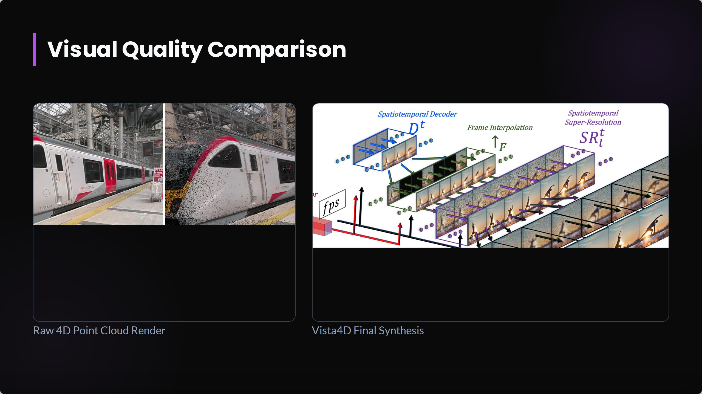

<!-- Page 10 -->

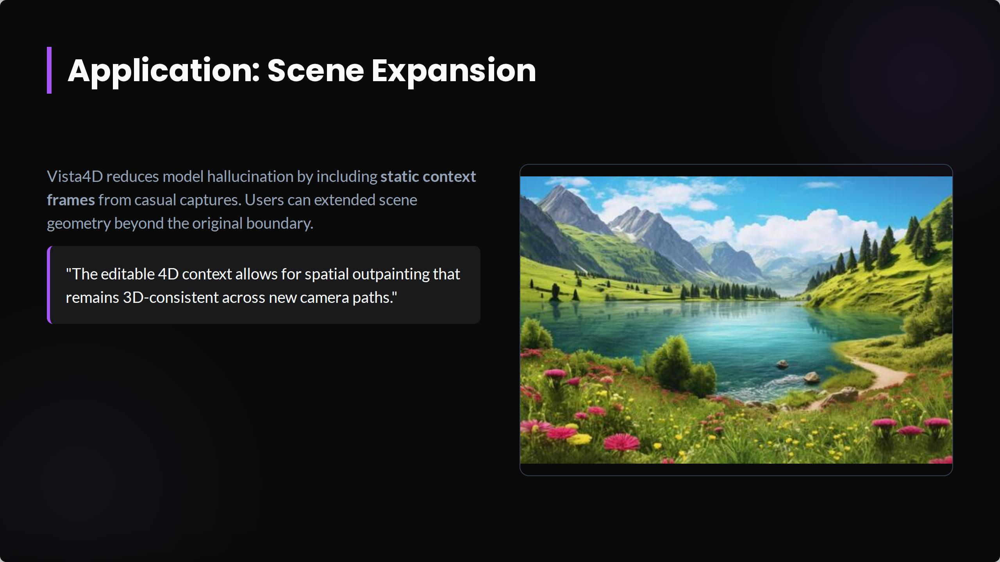

<!-- Page 11 -->

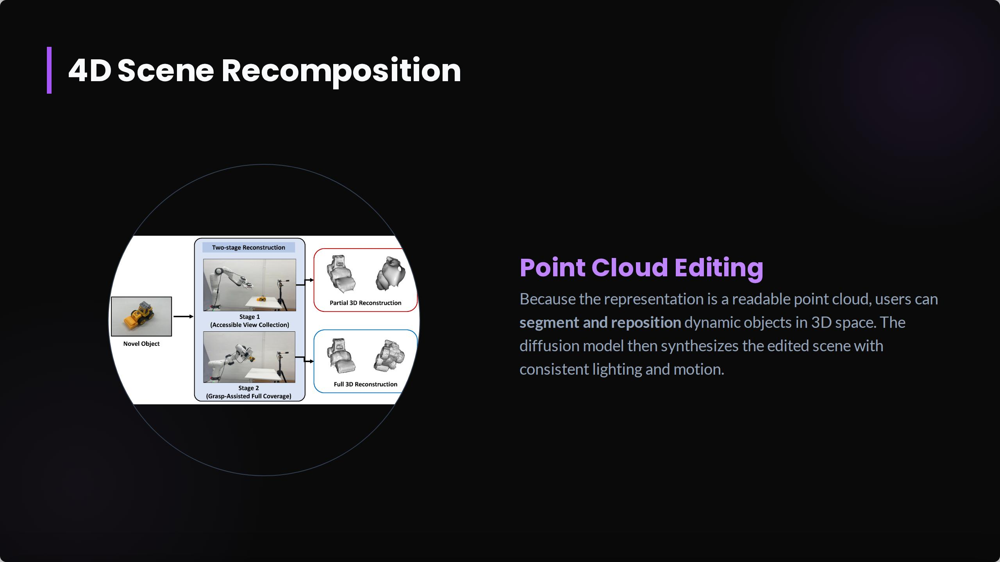

<!-- Page 12 -->

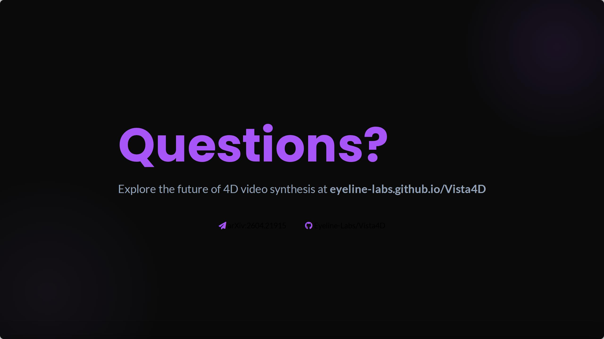

<!-- Page 13 -->

